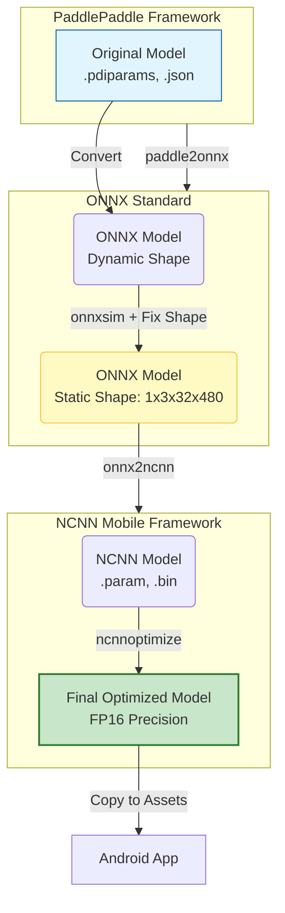

# PaddleOCR v5 to NCNN for Android 🚀

This repository provides a complete guide and tools to convert **PaddleOCR v5** (English and Thai recognition models) to the **NCNN** format, optimized for Android devices.

The goal is to enable high-performance OCR on mobile devices using the lightweight NCNN framework.

---

## 📈 Conversion Workflow

We use a multi-step pipeline to ensure the models are compatible with mobile NCNN runtimes (which often require static shapes) and are optimized for size and speed (FP16).



### Why these steps?
1.  **Paddle2ONNX**: Converts the proprietary Paddle format to the standard ONNX format.
2.  **ONNX Sim + Fix Shape**: Mobile GPU drivers and SVTR layers often fail with dynamic input shapes. We fix the input to `1,3,32,480` (Height 32, Width 480) to ensure stability and compatibility with PP-OCRv5's MatMul/InnerProduct layers.
3.  **NCNN Optimize**: Converts weights to FP16 (Half precision), reducing the model size to ~3.9MB without significant accuracy loss.

---

## 📂 Repository Structure & Results

The `models/` directory is organized by the stage of conversion. **You only need the files in `models/ncnn/` for your app.**

```text
paddleocr-v5-ncnn-android/
├── convert_pipeline.py      # Python script to automate the full conversion flow
├── models/
│   ├── paddle/              # 1. Raw PaddleOCR Models (Source)
│   │   ├── en/
│   │   └── th/
│   ├── onnx/                # 2. Intermediate ONNX Models (Fixed Shape: 1x3x32x480)
│   │   ├── rec_en_sim_fixed.onnx
│   │   └── rec_th_sim_fixed.onnx
│   └── ncnn/                # 3. 🎉 FINAL RESULTS (Ready for Android!)
│       ├── en/
│       │   ├── rec_en_opt.bin   # Optimized Weights (3.9 MB)
│       │   └── rec_en_opt.param # Network Graph
│       └── th/
│           ├── rec_th_opt.bin   # Optimized Weights (3.9 MB)
│           └── rec_th_opt.param # Network Graph
```

---

## 📱 Quick Integration Guide (Android C++/JNI)

### 1. Copy Files
Copy the `.param` and `.bin` files from `models/ncnn/` to your Android project's assets folder:
`app/src/main/assets/models/`

### 2. Load Model

Use the NCNN C++ API to load and run the model.

```cpp
#include "net.h"
#include <android/asset_manager_jni.h>

// Initialize
ncnn::Net recNet;
ncnn::Option opt;
opt.lightmode = true;
opt.num_threads = 4;
opt.use_fp16_arithmetic = true; // IMPORTANT for performance
recNet.opt = opt;

// Load files from AssetManager
// Ensure you handle AAssetManager properly in your JNI code
int ret1 = recNet.load_param(assetManager, "models/rec_th_opt.param");
int ret2 = recNet.load_model(assetManager, "models/rec_th_opt.bin");

if (ret1 != 0 || ret2 != 0) {
    // Handle error
}
```

### 3. Run Inference

```cpp
// internal helper to get Mat from bitmap
ncnn::Mat in = ncnn::Mat::from_android_bitmap(env, bitmap, ncnn::Mat::PIXEL_RGB);

// Create Extractor
ncnn::Extractor ex = recNet.create_extractor();

// ⚠️ Input layer name is 'x' (fixed during conversion)
ex.input("x", in);

ncnn::Mat out;
// ⚠️ Output layer name is 'fetch_name_0' (fixed during conversion)
ex.extract("fetch_name_0", out);

// process 'out' to get text result...
```

---

## 💻 How to Reproduce / Development

If you want to convert new models or change the input shape constraints, follow these steps to run the conversion pipeline yourself.

### 1. Prerequisites
Install the required system tools:
```bash
brew install cmake protobuf git
```

### 2. Setup Python Environment
```bash
python3 -m venv venv
source venv/bin/activate
pip install paddlepaddle paddle2onnx onnx onnxsim
```

### 3. Build NCNN Tools
We need the `onnx2ncnn` and `ncnnoptimize` CLI tools.
```bash
git clone https://github.com/Tencent/ncnn.git
cd ncnn/build
cmake -DCMAKE_BUILD_TYPE=Release -DNCNN_BUILD_TOOLS=ON -DNCNN_VULKAN=OFF ..
make -j8
cd ../..
```

### 4. Run the Pipeline Script
We have provided an automated script `convert_pipeline.py` that handles the entire flow.
```bash
source venv/bin/activate
python convert_pipeline.py
```

This will automatically:
1.  **Retrieve** source models from `models/paddle/`.
2.  **Convert** Paddle -> ONNX.
3.  **Simplify & Fix Shapes** -> ONNX (Force input shape `1,3,48,320`).
4.  **Convert** ONNX -> NCNN.
5.  **Optimize** NCNN Models (Enable FP16).

---

## 🔗 References

*   [PaddleOCR v5 Performance Comparison](https://www.paddleocr.ai/main/en/version3.x/algorithm/PP-OCRv5/PP-OCRv5_multi_languages.html?utm_source=chatgpt.com#3-performance-comparison)
